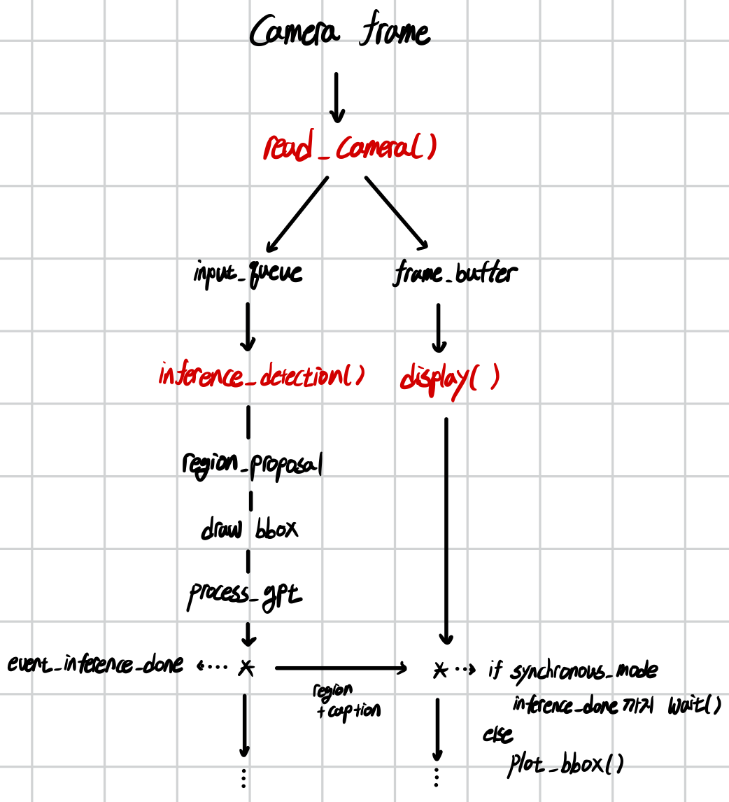

# W/O Camera

- **demo_gpt_images.py**
    - **Florence-2** `<Captioning>` ⇒ `<Visual Grounding>` ⇒ **GPT-4o** `<Situation Understanding>`
    - image directory -> result directory

# W/ Camera
- **demo.py**
    - **Florence-2** `<Captioning>` ⇒ `<Visual Grounding>`

- **demo_fl2+gpt.py**
    - **Florence-2** `<Captioning>` ⇒ `<Visual Grounding>` ⇒ **GPT-4o** `<Situation Understanding>`
    - ```
      # 출력 예시
      모니터가 놓인 상황 (gpt: 0.4293s | total: 0.8064s)
      모니터 두 대가 있는 상황 (gpt: 0.7073s | total: 1.1498s)
      모니터 앞에 앉은 상황 (gpt: 0.6782s | total: 1.1239s)
      두 대의 모니터가 있는 상황 (gpt: 0.9649s | total: 1.3370s)
      모니터와 책상이 있는 상황. (gpt: 0.5328s | total: 0.8983s)
      ...
      ```

- **demo_only_gpt.py**
    - **GPT-4o** `<Situation Understanding>`, `<OV-OD>`
    - ```
      # 출력 예시
      {situation}: 라면과 만두를 먹으려는 상황
      {location}: 라면: [50, 100, 300, 250]
                  만두: [320, 150, 450, 220] (gpt: 3.0590s | total: 3.0593s)
      ...
      ```
- **demo_fl2_region_prompt+gpt.py**
    - **Florence-2** `<Region Proposal>` ⇒ **GPT-4o** `<Situation Understanding>`, `<Classification>`
    - ```
      #출력 예시
      {situation}: 라면과 만두를 먹는 상황
      {location}: 라면: [41.28, 125.04, 418.24, 420.24]
                  만두: [391.36, 181.68, 579.52, 412.08] (gpt: 2.5842s | total: 2.7145s)   
      ```

- **demo_frcnn_region_prompt+gpt.py**
    - **Faster R-CNN** `<Region Proposal>` ⇒ **GPT-4o** `<Situation Understanding>`, `<Classification>`
    - ```
      #출력 예시
      {situation}: 식당에서 음식을 먹는 상황
      {location}: 객체 1: 돈코츠 라멘
                  객체 2: 반숙 계란
                  객체 3: 파 채소
                  객체 4: 김치 소스
                  객체 5: 식사용 젓가락
                  객체 6: 일본식 만두
                  객체 7: 물컵 (gpt: 5.0639s | total: 5.0954s)
      ``` 

- **main_gpt.py**
    - 

# Prerequisite 
```bash 
Python version: 3.11.9
OpenCV version: 4.10.0
Pillow (PIL) version: 10.4.0
PyTorch version: 2.4.0
    torch==2.4.0
    torchaudio==2.4.0
    torchelastic==0.2.2
    torchvision==0.19.0
CUDA version: 12.1
Transformers version: 4.44.0
    einops==0.8.0
    flash-attn==2.6.3
    timm==1.0.8
```
```bash
pip install opencv-python timm einops flash_attn transformers
```

### Openai API Key 입력
```bash
export OPENAI_API_KEY='sk-proj-...'
```

ImportError 발생 시
``` bash
# ImportError: libGL.so.1: cannot open shared object file: No such file or directory
apt-get install -y libgl1-mesa-glx libglib2.0-0
# pip install opencv-python timm einops flash_attn transformers
```

